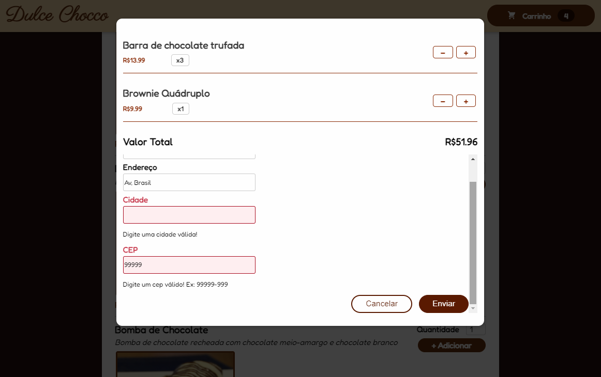
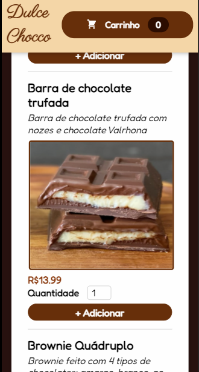

# Dulce Chocco - Chocolataria

## Opa oi oi! Esse projeto foi desenvolvido em React com styled-components! Você pode acessar a aplicação clicando aqui!

A aplicação consiste em simular um app de pedidos de doces de chocolates, integrado com um backend no Firebase. 

Esse é um projeto de estudo, visando aplicar minhas habilidades simulando uma aplicação real e funcional.

## 👨‍💻 Linguagens e ferramentas utilizadas:
- React
- Styled-Components
- Firebase (Backend)

## 📱 Dispositivos homologados:
A aplicação opera nas seguintes dimensões de telas:
- 1440px
- 720px
- 600x

## 💻 Features do App

- [x] Carrinho com adição e exclusão dinâmica de itens
- [x] Itens do menu importados diretamente da API no Firebase
- [X] Respostas para bugs de rede, requisições, etc
- [x] Validação dos campos de dados do usuário
- [X] Responsividade 
- [x] Envio de pedidos diretamente para o Backend, simulando uma aplicação real

## ☕ Usando o App
- Você pode utilizar o app escolhendo os itens e as quantidades desejadas
- Ao abrir o carrinho e clicar em "Encomendar" será aberto campo de validações
- Insira os dados requisitados, clique em enviar e pronto!

